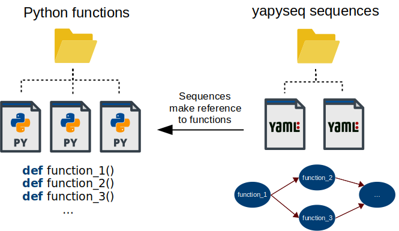
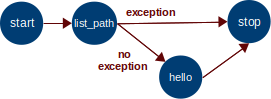

# yapyseq

Yet Another Python Sequencer

| Item          | master        | dev   |
| ------------- | ------------- | ----- |
| CI status     | [](https://travis-ci.com/RomainTT/yapyseq) | [](https://travis-ci.com/RomainTT/yapyseq) |
| version       | [](https://pypi.org/project/yapyseq/)      |  N/A  |

## Overview

If you have a bunch of Python functions in a bunch of files, which can be called
in various orders in function of the need, you have two choices:

* Call these functions in classic python scripts, ordering the calls with
  Python statements. You have to write from scratch the conditional structures,
  the multiprocessing management if necessary, and eventually write a lot of 
  code.
* Use yapyseq to write a sequence. A sequence file has its own syntax, it makes
  references to Python functions that must be called. The calls, the conditional
  transitions between them, the multiprocessing, the logging, all of these
  things are automatically managed by yapyseq without writing a single line of
  Python code.




## Installation

yapyseq is on the [Pypi](https://pypi.org) server. To install it, 
you can use `pip`:

    pip install yapyseq


## Quick-start

Let's assume that you have a project in the directory `project/` with a 
sub-directory `project/functions` containing some Python files like
 `project/functions/hello.py`, and some functions like the following ones:

```python
import os

def hello(name):
    print('Hello {}!'.format(name))

def list_path(path):
    print(os.listdir(path))
```

Now create a sequence file anywhere, for instance `project/my_sequence.yaml`. 
Here is the content of a sequence to call `list_path`, and if no exception has 
been raised then call `hello`:



```yaml
sequence:

  nodes:
    - id: 0
      type: start
      transitions:
        - target: 1

    - id: 1
      type: function
      function: list_path
      arguments:
        path: "/tmp/"
      transitions:
        - target: 2
          condition: not results[1].exception
        - target: 3
          condition: results[1].exception

    - id: 2
      type: function
      function: hello
      arguments:
        name: "John"
      transitions:
        - target: 3

    - id: 3
      type: stop
```

To run the sequence in command line, run the following command in a terminal:

```bash
yapyseq run Project/my_sequence.yaml Project/Functions
```

The command `yapyseq run` takes as arguments: the path to the sequence file
and the path to the directory containing the Python functions.

After pressing enter, you should see the output of `list_path()` and `hello()`
in the terminal.

To run the sequence using `yapyseq` as a Python module, run the following code:

```python
from yapyseq import SequenceRunner

sr = SequenceRunner('Project/my_sequence.yaml', 'Project/Functions')
sr.run()
```

Of course, for an example that simple, making a sequence with yapyseq requires
more work than calling the functions in a simple Python script. But it is just
an example to start, and yapyseq will be much more useful in more complex
situations. Please read the next sections to learn more.

## More details for users

To get more details about how to use `yapyseq`, please read the
[user documentation](doc/userdoc.md).

## Contributions

Contributions are welcome from anyone ! To have a better understanding of the
internal structure of `yapyseq` and to know more about the integration
process, please read the [developer documentation](doc/devdoc.md).
