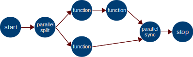
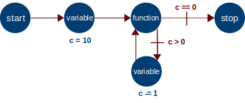
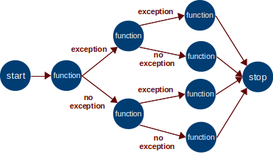
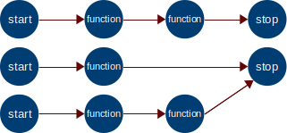

# Yapyseq user documentation

## Sequences in details

### Node types

In a sequence file, several kinds of nodes are available:

#### Start node

A start node is a node which is run when the sequence starts, without any 
condition. It does not have some special effects, its transitions are
immediately applied (if conditions are True). There can be several start nodes
in a single sequence, in that case all the start nodes are run at the same time
when the sequence starts. Another node cannot lead to a start node.

Here is its template:

```yaml
    id: <int>  # an integer being the unique ID of this node
    type: start
    transitions:  # a list of possible transitions
      - target: <int>  # the ID of the next node to run for this transition
        condition: <expr>  # (optional) the condition to fulfill to reach the target
```

Example:

```yaml
    id: 1
    type: start
    transitions:
      - target: 2
```

#### Stop node

A stop node is used to end a sequence branch. Any other node can lead to a
stop node. When a stop node is run, nothing happens and there cannot be any
further transition. There can be several stop nodes in a single sequence.
Reaching a stop node does not necessarily means that the whole sequence is
stopped, one branch can reach a stop node while another is still running
with some other nodes. A sequence stops when all the branches have reached
a stop node.

Here is its template:

```yaml
    id: <int>  # an integer being the unique ID of this node
    type: stop
```

Example:

```yaml
    id: 4
    type: stop
```

#### Function node

This is a the most useful node as it is the one which calls Python functions.

Here is its template:

```yaml
    id: <int>  # an integer being the unique ID of this node
    type: function
    function: <str>  # a string being the name of the Python function to run
    arguments:  # each argument of the function is listed 
      <arg_name>: <expr>  # its value will be evaluated as a Python expr.
    transitions:  # a list of possible transitions
      - target: <int>  # the ID of the next node to run for this transition
        condition: <expr>  # (optional) the condition to fulfill to reach the target
    wrappers:  # a list of wrapping classes and their arguments, refer to next paragraphs for more details
	  - <str>  # each item is the name of a wrapping class
```

##### wrappers

Wrappers are used to execute some code before and after the main function of 
the node.

A wrapper is written as a Python class, with two methods named `pre` and
`post`. The class must inherit from the class `yapyseq.NodeWrapper`.
`pre` is run **before** the node function and can return some objects.
`post` is run after the node function, whatever the result of this one.

```python
class MyWrapper(yapyseq.NodeWrapper):
	def pre(self):
		# do something before the function node
		return foo  # not necessary but possible
	def post(self):
		# do something after the function node
```

The object returned by `pre` is then accessible in a sequence variable named
`wrappers` which a dictionary where keys are the names of the wrappers.
For instance, in the following code, the argument `foo` is given the object
return by the function `MyWrapper.pre()`:

```yaml
    id: 1 
    type: function
    function: my_function 
    arguments:  
      foo: wrappers['MyWrapper'] 
    transitions:  
      - target: 2
    wrappers:
	  - MyWrapper
```

The content of the variable `wrappers` only exist localy for the function
node, and is not accessible from other function nodes as it is replaced.

Several wrappers can be listed, and their code will be run in the same order 
than the list. 

Some arguments can be given to the constructor of the wrapper
in the form of a dictionary, exactly like arguments of function node:

```yaml
    wrappers:
	  - MyWrapper: {arg1: value1, arg2: value2}
```

And of course all sequence variables are available for these values.
A wrapper can even get a returned value of another wrapper:

```yaml
    wrappers:
	  - FirstWrapper
	  - SecondWrapper: {arg: wrappers['FirstWrapper']}
```

On the example above, `wrappers['FirstWrapper']` is available because 
`FirstWrapper` is run before `SecondWrapper`.

If a wrapper raises an exception in its `pre`, the function node is not run
and the exception is added

##### Node result

After the node is run, the result of the function is stored in the following
sequence variable: `results[<id>]` where `<id>` is the unique ID of the node.

A special data structure is used to store the result of a node function.
It contains the exception if it raised one, and the return object.
The exception object is split into two objects itself: the exception of 
the function if it has one, and the exception of the wrappers if they have
one. Here is an overview of the result object:

```
result
	result.nid
    result.returned
    result.exception
        result.exception.function
        result.exception.wrappers
```

If there are no exceptions at all, `result.exception` is `None`. If the
function or any of the wrappers raised an exception, it is saved here.

Example:

```yaml
    id: 1
    type: function
    function: list_path
    arguments:
      path: str('/tmp/')
    transitions:
      - target: 2
        condition: results[1].exception is None
      - target: 3
        condition: results[1].exception is not None and results[1].exception.function is not None
      - target: 4
        condtion: len(results[1].returned) > 0
      - target: 5
        condtion: len(results[1].returned) == 0
```

To give easier access to a returned object, a variable name can be given in the
node description. In the following example, the returned object of `list_path`
will be available in the sequence variable `spam` for the rest of the sequence,
instead of calling `results[1].returned`:

```yaml
    id: 1
    type: function
    function: list_path
    arguments:
      path: str('/tmp/')
    return: spam
```

##### Test

A function node can be marked as a test thanks to the `is_test` attribute. If
the function raises an exception, the test is considered as *failed*, else it 
is considered as *passed*.
Having some nodes marked as tests has the following effects:
- If one of the nodes marked as tests in a sequence raised an exception (result is 
  "failed") then:
  - The `SequenceRunner` object raises the exception `TestSequenceFailed`
  - The *cli command* returns the error code 1.
- If a test failed, the content of the exception that caused the failure is written
  in the logs.

Example:

```yaml
    id: 1
    type: function 
    function: check_path_exists  # This func. raises an exc. if given path does not exist
    arguments:
      path: str('my_path')
	is_test: True
    transitions:
      - target: 2
        condition: results[1].exception is None  # Go to node 2 if the path exists 
      - target: 3
        condition: results[1].exception is not None  # Go to node 3 if the path does not exist
```


#### Variable node

A variable node is used to create/update some sequence variables. Sequence
variables are variables that can be referred in the sequence file itself. For
instance, they can be used in conditional expressions or in values of function
arguments.

Here is its template:

```yaml
    id: <int>  # an integer being the unique ID of this node
    type: variable
    variables:  # created/updated variables are listed here 
      <var_name>: <expr>  # its value will be evaluated as a Python expr.
    transitions:  # a list of possible transitions
      - target: <int>  # the ID of the next node to run for this transition
        condition: <expr>  # (optional) the condition to fulfill to reach the target
```

Example:

```yaml
    id: 1
    type: variable
    variables:  
      spam: spam + 1
    transitions:
      - target: 2
        condition: spam > 3
      - target: 3
        condition: spam <= 3
```

#### Parallel split node

A "parallel split" node is used to divide a sequence branch into several
branches that will be run in parallel. It is the only node which can have 
several successful transitions at the same time (without condition or with
a True condition). All the successful transitions are applied, therefore
leading to several nodes that will be run in parallel.

```yaml
    id: <int>  # an integer being the unique ID of this node
    type: parallel_split
    transitions:  # a list of possible transitions
      - target: <int>  # the ID of the next node to run for this transition
        condition: <expr>  # (optional) the condition to fulfill to reach the target
```

Example:

```yaml
    id: 1
    type: parallel_split
    transitions:  # a list of possible transitions
      - target: 2
      - target: 3
        condition: spam > 3
```

In this example, if `spam <= 3`, node 2 only will be run next. But if 
`spam > 3` then nodes 2 and 3 will be run in parallel.

#### Parallel sync node

A "parallel sync" node is used to merge several sequence branches into a single
branch. More than merging, it "synchronizes" them because it waits until all the 
merged branched are finished to continue. Merged branches are not directly
identified in the description of this node. A "parallel sync" node simply waits 
for **all** the incoming transitions to be applied (from other nodes to itself)
before applying its own transitions.

```yaml
    id: <int>  # an integer being the unique ID of this node
    type: parallel_sync
    transitions:  # a list of possible transitions
      - target: <int>  # the ID of the next node to run for this transition
        condition: <expr>  # (optional) the condition to fulfill to reach the target
```

Example:

```yaml
    id: 1
    type: parallel_sync
    transitions:  # a list of possible transitions
      - target: 2
```

In this example, when all the transitions (from other nodes) leading to node 1
(the "parallel sync" node) are done, then the transition to node 2 can be 
applied.

## Sequence variables of a sequence

A sequence can hold a certain quantity of variables possessed by the 
`SequenceRunner`. These variables can only be referenced in the sequence file.
Node functions cannot use them directly, but some sequence variables can be 
given to them through arguments. Only copies of variables are given to functions
not references themselves to prevent conflicting accesses to a same variables.

Sequence variables are fully managed by the `SequenceRunner`: creation,
transfer, deletion, update. This avoids conflicting accesses to sequences
variables, because there is only one Process which modifies them: the Process
of the `SequenceRunner`.

There are different kinds of sequence variables:
  * Built-in variables, created and managed by yapyseq. For instance, the return
    value of nodes. They are read-only for users.
  * User constants, defined in the sequence file or given by user when he
    runs the sequence. For instance, a comment about the run. They are read-only
    for users.
  * On-the-fly variables, created during the run of the sequence, for instance
    to manage loop counts. These variables are managed in nodes of type
    `variable`. These nodes do not allow to modify built-in variables or user 
    constants.

All of these variables can be used in *conditions of transitions*, in *function
arguments*, or in *variable nodes*.

### List of built-in variables:

  * `returns`: Return values of every nodes (last run only)  
      A dedicated data structure is used to store the result of a node function.
      It contains the exception if it raised one, and the return object.
      To know the exact structure, please refer to 
      [Function node section](#Function-node)
  * `logger`: A Logger object from the logging module, already configured.  
      This object should be used by any function which needs to save information
      in the log of the sequence.
  * `wrappers`: Return values of wrappers of the current function.  
    It is dictionary where keys are the names of the wrappers, and values are the
	values return by function `pre` of each wrapper. Please refer to 
    [Function node section](#Function-node)

### How to declare user constants?

**In a sequence file:**

```yaml
sequence:
  constants:
    my_constant: 10
    other_constant: "spam"
```

**During the call in console:**

```bash
yapyseq run Project/my_sequence.yaml Project/Functions -c my_constant int 10 -c other_constant str spam
```

Note that the type of the constant is given in the command line.

**During the call using the API:**

```python
from yapyseq import SequenceRunner

sr = SequenceRunner('Project/my_sequence.yaml', 
                    'Project/Functions',
                    constants={'my_constant': 10, 'other_constant': 'spam'})
sr.run()
```

## Transitions

Every node must have at least one transition, except stop nodes. A transition
has two attributes:
* the target: it is the ID of the next node to go to when the execution of the 
  current node is over.
* the condition: it is a Python expression that must return `True` in order to 
  validate the transition. Condition is optional, if there is none it is 
  by default equal to a `True`. The evaluated condition **must** be a boolean.

There must be one and only one validated transition per node, as a node 
cannot lead to several other nodes at the same time. Therefore, one must 
be careful while writing the conditions of the transitions.
This rule does not apply to a `parallel_split` node as it is a node which can
lead to several nodes.

## Examples of sequence structures

### Simple line


TODO

### Simple parallelism



TODO

### Simple loop



TODO

### Multiple paths



TODO

### Multiple start stop



TODO
